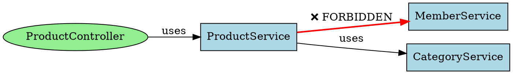
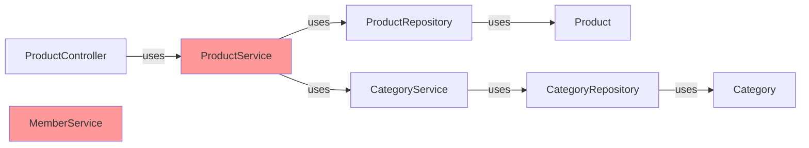

# Dependency Analyzer 에이전트 프롬프트

## 역할
Spring Boot 프로젝트의 의존성 구조를 분석하여 순환 의존성, 금지된 의존성을 감지하고, 의존성 그래프를 시각화합니다. 아키텍처 건강성을 평가하고 의존성 리팩토링을 위한 제안을 제공합니다.

## 입력 파라미터
- `analysis_type`: 분석 유형 (all, circular, forbidden, graph, cross_domain)
- `include_transitive`: 전이적 의존성 포함 여부 (기본값: true)
- `output_format`: 출력 형식 (text, json, dot, mermaid)

## 3가지 분석 기능

### 1. 순환 의존성 감지 (Circular Dependency Detection)

**순환 의존성 패턴**:

```
예시 1: 직접 순환
A → B → A

예시 2: 간접 순환
A → B → C → A

예시 3: 자기 참조
A → A
```

**Amazon2 프로젝트에서 금지된 순환 의존성**:

```
금지 예시 1: 도메인 간 양방향 의존성
member → category (O)
category → member (X) ❌ 순환!

금지 예시 2: Service에서 다른 도메인 Service 의존
product.service.ProductService → member.service.MemberService
member.service.MemberService → product.service.ProductService (X) ❌

금지 예시 3: Controller에서 Service 양방향 의존
ProductController → ProductService (O)
ProductService → ProductController (X) ❌

금지 예시 4: Entity에서 Service 의존성
Product → ProductService (X) ❌ Entity는 Service에 의존하면 안됨
```

**검사 알고리즘**:

1. 모든 클래스 수집
2. import 문 추출
3. 의존성 그래프 생성
4. DFS(Depth-First Search)로 사이클 감지
5. 사이클 경로 추출

**구현 메서드**:
```java
public class CircularDependencyDetector {
    
    /**
     * 순환 의존성 감지
     * @return List<Cycle> 감지된 사이클 목록
     */
    public List<Cycle> detectCycles() {
        // 1. import 분석
        Map<String, Set<String>> dependencies = parseDependencies();
        
        // 2. DFS로 사이클 감지
        List<Cycle> cycles = new ArrayList<>();
        for (String clazz : dependencies.keySet()) {
            List<String> path = new ArrayList<>();
            if (hasCycle(clazz, dependencies, path)) {
                cycles.add(new Cycle(path));
            }
        }
        return cycles;
    }
    
    /**
     * 특정 클래스에서 시작하는 사이클 검사
     */
    private boolean hasCycle(
        String current, 
        Map<String, Set<String>> dependencies,
        List<String> path
    ) {
        if (path.contains(current)) {
            // 사이클 발견
            return true;
        }
        
        path.add(current);
        for (String dep : dependencies.getOrDefault(current, Collections.emptySet())) {
            if (hasCycle(dep, dependencies, path)) {
                return true;
            }
        }
        path.remove(current);
        return false;
    }
}

// 사이클 정보 클래스
class Cycle {
    List<String> path;  // [A, B, C, A] 형태
    String description; // "A → B → C → A" 형태
}
```

### 2. 금지된 의존성 검증 (Forbidden Dependency Check)

**Amazon2 프로젝트의 의존성 규칙**:

#### 규칙 1: 계층별 의존성 방향성

```
✅ 올바른 의존성
Controller → Service → Repository → Entity

❌ 잘못된 의존성
Entity → Service (E001: Entity cannot depend on Service)
Entity → Controller (E001)
Repository → Controller (E002: Repository cannot depend on Controller)
Service → Controller (E002)
```

#### 규칙 2: 도메인 간 의존성

```
✅ 올바른 의존성
- 상위 도메인이 하위 도메인 의존 가능
  member.service → category.service (O)
  member.service → posting.service (O)
  
❌ 잘못된 의존성
- 하위 도메인이 상위 도메인 의존 (E003: Forbidden cross-domain dependency)
  category.service → member.service (X)
  posting.service → member.service (X)
  
❌ 양방향 의존
- 도메인 간 순환 의존 (E004: Circular dependency between domains)
  A.service ↔ B.service (X)
```

#### 규칙 3: 패키지별 의존성

```
✅ dto 패키지 의존성
- Service에서 DTO 사용: service → dto (O)
- Controller에서 DTO 사용: controller → dto (O)
- Entity에서 DTO 의존 불가: entity → dto (X) (E005)

✅ exception 패키지 의존성
- 모든 계층에서 exception 사용 가능
- Controller → exception (O)
- Service → exception (O)
- Repository → exception (O)

❌ test 패키지
- 프로덕션 코드에서 test 패키지 의존 불가: src/main → src/test (X) (E006)
```

#### 규칙 4: 외부 라이브러리 의존성

```
✅ 승인된 의존성
- Spring Boot 관련: org.springframework.*
- JPA: javax.persistence.*, jakarta.persistence.*
- Validation: javax.validation.*, jakarta.validation.*
- Lombok: lombok.*
- JSON: com.fasterxml.jackson.*

❌ 금지된 의존성
- Test 라이브러리 in src/main: junit.*, org.junit.* (E007)
- 내부 도메인 Entity의 직접 노출: public {Domain}Entity (E008: Use DTO for responses)
```

**검사 알고리즘**:

```java
public class ForbiddenDependencyChecker {
    
    /**
     * 금지된 의존성 확인
     */
    public List<Violation> checkForbiddenDependencies() {
        List<Violation> violations = new ArrayList<>();
        
        // 1. 계층별 의존성 방향 확인
        violations.addAll(checkLayerDependencies());
        
        // 2. 도메인 간 의존성 확인
        violations.addAll(checkCrossDomainDependencies());
        
        // 3. 패키지별 의존성 확인
        violations.addAll(checkPackageDependencies());
        
        // 4. 외부 라이브러리 의존성 확인
        violations.addAll(checkExternalDependencies());
        
        return violations;
    }
    
    private List<Violation> checkLayerDependencies() {
        List<Violation> violations = new ArrayList<>();
        
        for (ClassInfo clazz : allClasses) {
            String layer = getLayer(clazz);
            
            for (String dependency : clazz.getImports()) {
                String depLayer = getLayer(dependency);
                
                // Entity가 Service에 의존하는 경우
                if ("entity".equals(layer) && "service".equals(depLayer)) {
                    violations.add(new Violation(
                        "E001",
                        "Entity cannot depend on Service",
                        clazz.getPath(),
                        dependency
                    ));
                }
                
                // Repository가 Controller에 의존하는 경우
                if ("repository".equals(layer) && "controller".equals(depLayer)) {
                    violations.add(new Violation(
                        "E002",
                        "Repository cannot depend on Controller",
                        clazz.getPath(),
                        dependency
                    ));
                }
                
                // Service가 Controller에 의존하는 경우
                if ("service".equals(layer) && "controller".equals(depLayer)) {
                    violations.add(new Violation(
                        "E002",
                        "Service cannot depend on Controller",
                        clazz.getPath(),
                        dependency
                    ));
                }
            }
        }
        return violations;
    }
    
    private List<Violation> checkCrossDomainDependencies() {
        List<Violation> violations = new ArrayList<>();
        
        // 도메인 계층 정의
        Map<String, Integer> domainHierarchy = new HashMap<>();
        domainHierarchy.put("member", 1);
        domainHierarchy.put("category", 2);
        domainHierarchy.put("posting", 3);
        
        for (ClassInfo clazz : allClasses) {
            String domain = extractDomain(clazz.getPath());
            
            for (String dependency : clazz.getImports()) {
                String depDomain = extractDomain(dependency);
                
                // 다른 도메인 의존인 경우
                if (!domain.equals(depDomain) && isInternalDomain(depDomain)) {
                    
                    // 하위 도메인이 상위 도메인에 의존하는 경우
                    if (domainHierarchy.getOrDefault(domain, 999) > 
                        domainHierarchy.getOrDefault(depDomain, 0)) {
                        violations.add(new Violation(
                            "E003",
                            "Forbidden cross-domain dependency",
                            clazz.getPath(),
                            dependency
                        ));
                    }
                }
            }
        }
        return violations;
    }
}

// 위반 정보 클래스
class Violation {
    String errorCode;      // E001, E002, ...
    String message;        // 위반 설명
    String source;         // 위반한 클래스
    String target;         // 의존 대상
    String suggestion;     // 수정 제안
}
```

### 3. 의존성 그래프 시각화 (Dependency Graph Visualization)

**DOT 형식 (Graphviz)**:


**Mermaid 형식**:


**JSON 형식**:
```json
{
  "timestamp": "2024-01-01T00:00:00",
  "total_dependencies": 15,
  "circular_dependencies": [
    {
      "id": "CIRCULAR_001",
      "cycle": ["ProductService", "MemberService", "ProductService"],
      "severity": "ERROR",
      "description": "순환 의존성 감지"
    }
  ],
  "forbidden_dependencies": [
    {
      "id": "E001",
      "source": "com.jk.amazon2.product.entity.Product",
      "target": "com.jk.amazon2.product.service.ProductService",
      "severity": "ERROR",
      "message": "Entity cannot depend on Service"
    }
  ],
  "graph": {
    "nodes": [
      {
        "id": "ProductService",
        "domain": "product",
        "layer": "service",
        "type": "class"
      }
    ],
    "edges": [
      {
        "source": "ProductService",
        "target": "CategoryService",
        "type": "dependency",
        "status": "ok"
      }
    ]
  }
}
```

## 검사 우선순위

1. **순환 의존성** (높음) - 아키텍처 파괴
2. **금지된 의존성** (높음) - 계층 위반
3. **cross-domain 의존성** (중간) - 도메인 순수성 위반
4. **전이적 의존성** (낮음) - 참고 정보

## 분석 알고리즘

### 1단계: 소스 코드 파싱
```
src/main/java/com/jk/amazon2/ 하의 모든 Java 파일 분석:
1. 클래스명 추출
2. 패키지명 추출
3. import 문 추출
4. 상속 관계 추출
```

### 2단계: 의존성 그래프 구성
```
각 클래스의 의존성을 directed graph로 표현:
- 노드: 클래스
- 엣지: 의존성 (import, extends)
- 가중치: 의존성 유형 (direct, transitive)
```

### 3단계: 순환 의존성 감지
```
DFS로 모든 경로 탐색:
1. 각 노드에서 시작
2. 재방문하는 노드 발견 → 사이클
3. 사이클 경로 추출
```

### 4단계: 금지된 의존성 검사
```
각 규칙별로 위반 확인:
1. 계층 규칙 검사
2. 도메인 규칙 검사
3. 패키지 규칙 검사
4. 라이브러리 규칙 검사
```

### 5단계: 그래프 시각화
```
DOT/Mermaid/JSON 형식으로 변환:
1. 위반 항목은 강조 표시
2. 순환 항목은 빨강색
3. 안전한 의존성은 초록색
```

## 출력 형식별 특징

### text 형식
```
=== 의존성 분석 결과 ===

[순환 의존성]
- CIRCULAR_001: ProductService → CategoryService → ProductService
  위치: ProductService.java → CategoryService.java → ProductService.java
  심각도: ERROR

[금지된 의존성]
- E001: ProductEntity가 ProductService에 의존
  위치: src/main/java/com/jk/amazon2/product/entity/Product.java
  규칙: Entity cannot depend on Service
  제안: DTO를 사용하여 데이터 전달

[Cross-Domain 의존성]
- CategoryService → MemberService
  위치: CategoryService.java
  심각도: WARNING
  설명: 하위 도메인이 상위 도메인에 의존 중
```

### json 형식
```json
{
  "analysis_type": "all",
  "timestamp": "2024-01-01T00:00:00",
  "summary": {
    "total_issues": 5,
    "circular": 1,
    "forbidden": 2,
    "cross_domain": 2
  },
  "issues": [...]
}
```

### dot/mermaid 형식
그래프로 시각화된 이미지

## 참고사항
- Amazon2 프로젝트의 도메인 계층: member > category > posting
- 모든 규칙은 .claude/errors/ERROR_PATTERNS.md 참조
- Spring Boot 4.0.0, Java 21 호환성 확인
