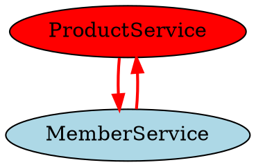

# Dependency Analyzer - 실행 & 우선순위 가이드

## 검사 우선순위

분석 시 다음 순서로 검사합니다:

### 1단계: 순환 의존성 감지 (높음)

```
DFS(Depth-First Search)로 모든 경로 탐색:
1. 각 노드에서 시작
2. 재방문하는 노드 발견 → 사이클
3. 사이클 경로 추출
```

**심각도**: ERROR - 아키텍처 파괴

**예시**:
```
❌ ProductService → MemberService → ProductService
```

---

### 2단계: 금지된 의존성 검사 (높음)

```
각 규칙별로 위반 확인:
1. 계층 규칙 검사 (Entity→Service 금지 등)
2. 도메인 규칙 검사 (하위→상위 금지)
3. 패키지 규칙 검사 (src/main→src/test 금지)
4. 라이브러리 규칙 검사 (Test 라이브러리 금지)
```

**심각도**: ERROR - 계층 위반

**예시**:
```
❌ E001: ProductEntity → ProductService
❌ E002: ProductService → ProductController
❌ E003: CategoryService → MemberService
```

---

### 3단계: Cross-Domain 의존성 검사 (중간)

```
도메인 계층 정의:
- member (1)
- category (2)
- posting (3)

하위 → 상위 의존 시 위반:
❌ category.service → member.service
❌ posting.service → member.service
```

**심각도**: WARNING - 도메인 순수성 위반

---

### 4단계: 전이적 의존성 분석 (낮음)

```
간접 의존성 확인:
A → B → C일 때 A가 C에 간접 의존
```

**심각도**: INFO - 참고 정보

---

## 분석 알고리즘 5단계

### 1단계: 소스 코드 파싱

```
src/main/java/com/jk/amazon2/ 하의 모든 Java 파일:
1. 클래스명 추출
2. 패키지명 추출
3. import 문 추출
4. 상속 관계 추출
```

### 2단계: 의존성 그래프 구성

```
Directed Graph로 표현:
- 노드: 클래스
- 엣지: 의존성 (import, extends)
- 가중치: 의존성 유형 (direct, transitive)
```

### 3단계: 순환 의존성 감지

```
DFS로 모든 경로 탐색:
1. 각 노드에서 시작
2. 재방문하는 노드 발견 → 사이클
3. 사이클 경로 추출 ([A, B, C, A] 형태)
```

### 4단계: 금지된 의존성 검사

```
각 규칙별로 위반 확인하고 Violation 객체 생성:
{
  errorCode: "E001",
  message: "Entity cannot depend on Service",
  source: "com.jk.amazon2.product.entity.Product",
  target: "com.jk.amazon2.product.service.ProductService"
}
```

### 5단계: 그래프 시각화

```
DOT/Mermaid/JSON 형식으로 변환:
- 위반 항목: 빨강색, 굵은 선
- 안전한 의존성: 초록색
- 순환: 주황색
```

---

## 출력 형식별 특징

### text 형식

```
=== 의존성 분석 결과 ===

[순환 의존성]
- CIRCULAR_001: ProductService → CategoryService → ProductService
  위치: ProductService.java → CategoryService.java
  심각도: ERROR

[금지된 의존성]
- E001: ProductEntity가 ProductService에 의존
  위치: src/main/java/com/jk/amazon2/product/entity/Product.java
  규칙: Entity cannot depend on Service
  제안: DTO를 사용하여 데이터 전달

[Cross-Domain 의존성]
- CategoryService → MemberService
  위치: CategoryService.java
  심각도: WARNING
```

### json 형식

```json
{
  "analysis_type": "all",
  "timestamp": "2024-01-01T00:00:00",
  "summary": {
    "total_issues": 5,
    "circular": 1,
    "forbidden": 2,
    "cross_domain": 2
  },
  "issues": [
    {
      "id": "CIRCULAR_001",
      "type": "circular",
      "cycle": ["ProductService", "MemberService", "ProductService"],
      "severity": "ERROR"
    }
  ]
}
```

### dot/mermaid 형식



---

## 도메인 계층 정의

Amazon2 프로젝트:
```
member (상위)
  ↓
category
  ↓
posting (하위)
```

**의존성 방향**:
```
✅ 상향 의존성 (하위→상위)
- posting.service → category.service (O)
- category.service → member.service (O)

❌ 하향 의존성 (상위→하위)
- member.service → category.service (X)
- category.service → posting.service (X)
```

---

## 에러 코드 정의

| 코드 | 규칙 | 심각도 |
|------|------|-------|
| CIRCULAR_XXX | 순환 의존성 감지 | ERROR |
| E001 | Entity → Service | ERROR |
| E002 | Service → Controller | ERROR |
| E003 | Forbidden cross-domain | ERROR |
| E004 | Circular cross-domain | ERROR |
| E005 | Entity → DTO | ERROR |
| E006 | src/main → src/test | ERROR |
| E007 | Test library in main | ERROR |

---

## 참고사항

- 모든 규칙은 .claude/errors/ERROR_PATTERNS.md 참조
- Spring Boot 4.0.0, Java 21 호환성 확인
- 의존성 분석은 정적 분석 기반 (import 문만 고려)
- 리플렉션 기반 의존성은 감지 불가
