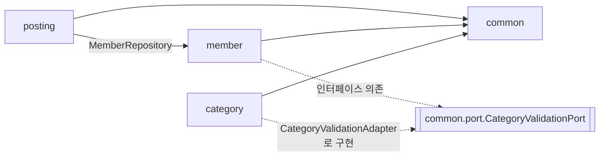
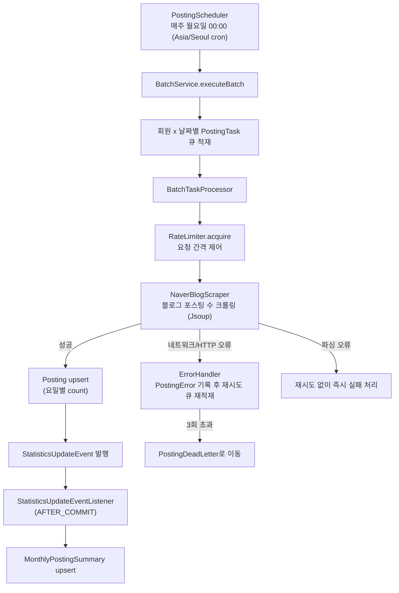

# Amazon2 - Blog Management Service
네이버 블로그 모임을 위한 관리 및 조회 서비스입니다.

---
## 1.프로젝트 개요
기존 프로토타입의 성능 이슈와 설계 한계를 극복하기 위해 진행되는 리뉴얼 프로젝트입니다.
- **데이터 관리**: 파일 시스템 기반 관리에서 RDBMS(MySQL)으로 전환
- **성능 개선**: 관리 인원 증가에 따른 응답 지연 해결 및 속도 최적화
- **안정성**: 라즈베리파이 단일 서버에서 클라우드 기반 확장 가능 구조로 재설계

---
## 2. 목표
- 포스팅 수 확인 및 인원 관리 응답 속도 대폭 개선
- 장애 복구 시나리오 확보 및 실시간 모니터링 체계 구축
- AWS 이전을 고려한 컨테이너 기반 인프라 확장성 확보

---
## 3. 기술 스택
### Backend / Database
- Java 21, Spring Boot 4.0.0
- JPA (Hibernate 6), QueryDSL 7.1, MySQL 8.x, Flyway
- SpringDoc OpenAPI 3.0.0 (Swagger), Jsoup (네이버 블로그 크롤링)

### Frontend
- 현재: HTML/CSS/JS (Nginx 정적 제공)
- 향후: React 기반 SPA 전환 및 AWS CloudFront/S3 배포 예정

### Infra / Test
- Docker, Docker Compose, Nginx
- Testcontainers (MySQL 기반 통합 테스트)

## 4. 시스템 아키텍처

### 4.1 레이어드 아키텍처

도메인별로 `controller → service → repository → entity` 계층을 따르며, `common`은 감사(auditing) 필드·공통 예외·도메인 간 포트 인터페이스를 제공한다. 도메인별 상세 구현 규칙은 [harnesses/](harnesses/README.md)를 참고한다.

```
src/main/java/com/jk/amazon2/
├── member/      controller · service · repository · entity · dto · exception
├── category/    controller · service · repository · entity · dto · exception · adapter
├── posting/     controller · service · repository · entity · dto · event · scheduler · config
├── common/      공통 엔티티(BaseAudit/BaseCreation) · 공통 예외 · 도메인 간 포트(port)
└── config/      CORS, Swagger, QueryDSL, Flyway, JPA Auditing 등 Spring 설정
```

### 4.2 도메인 의존성 구조

`posting`은 `member`를 직접 참조하지만, `member`는 `category`를 직접 참조하지 않는다. 대신 `common.port.CategoryValidationPort` 인터페이스에만 의존하고, `category` 모듈이 `CategoryValidationAdapter`로 이를 구현한다 (의존성 역전).



### 4.3 포스팅 수집 배치 파이프라인

`posting` 도메인의 핵심은 네이버 블로그 포스팅 수를 주기적으로 수집하는 배치 파이프라인이다. 실패는 재시도 후 Dead Letter로 격리되며, 저장 성공 시 이벤트 기반으로 월별 집계를 갱신한다.



수집 현황(배치 상태, 에러/Dead Letter 목록, 통계)은 `MonitoringController`(`/api/postings/**`)를 통해 조회 및 재처리(retry)할 수 있다.

### 4.4 데이터 모델

전체 ERD는 [docs/ERD.md](docs/ERD.md)를 참고한다. 핵심 도메인(`BLOG_CATEGORY`, `MEMBER`, `POSTING`)과 배치/모니터링용 테이블(`BATCH_EXECUTION`, `POSTING_ERROR`, `POSTING_DEAD_LETTER`, `MONTHLY_POSTING_SUMMARY`)로 구분되어 있다.

### 4.5 API 개요

| 도메인 | 메서드 & 경로 | 설명 |
|--------|--------------|------|
| Member | `GET /members`, `GET /members/{nickname}` | 회원 목록/단건 조회 |
| Member | `POST /members` | 회원 등록 |
| Member | `PUT /members/{nickname}` | 회원 수정 |
| Member | `DELETE /members/{nickname}` | 회원 삭제(soft delete) |
| Member | `DELETE /members/{nickname}/permanent` | 회원 영구 삭제 |
| Member | `PATCH /members/{nickname}/restore` | 삭제된 회원 복구 |
| Category | `GET /categories`, `GET /categories/{code}` | 카테고리 목록/단건 조회 |
| Category | `POST /categories`, `PUT /categories/{code}`, `DELETE /categories/{code}` | 카테고리 등록/수정/삭제 |
| Posting | `GET /postings` | 포스팅 목록 조회 (기간/회원 검색) |
| Posting | `POST /batch` | 수동 배치 실행 |
| Monitoring | `GET /api/postings/batch/status` | 배치 실행 현황 조회 |
| Monitoring | `GET /api/postings/errors`, `GET /api/postings/dead-letters` | 에러/Dead Letter 목록 조회 |
| Monitoring | `POST /api/postings/errors/{id}/retry`, `POST /api/postings/dead-letters/{id}/retry` | 에러/Dead Letter 재처리 |
| Monitoring | `GET /api/postings/statistics`, `GET /api/postings/weekly-statistics` | 기간별/주별 통계 조회 |
| Monitoring | `GET /api/postings/monthly-ranking` | 월별 포스팅 랭킹 조회 |

전체 스펙은 로컬 실행 후 Swagger UI(`/swagger-ui/index.html`)에서 확인한다.

## 5. 문서 및 API 명세
- [요구사항 명세서](/docs/Requirements.md)
- [ERD 다이어그램](/docs/ERD.md)
- [개발 가이드](/docs/DEVELOPMENT.md)
- [API 명세서](http://localhost:8080/swagger-ui/index.html)
- [API 문서](http://localhost:8080/v3/api-docs)

## 6. 로컬(Local) 환경 세팅 절차
### 6.1 프로파일 전략
애플리케이션은 실행 환경에 따라 설정을 분리하여 관리한다.
- `application.yml`: 공통 기본 설정
- `application-local.yml`: 로컬 개발 전용 (DB 접속 등)
- `application-test.yml`: 통합 테스트용 (Testcontainers 활용)
- `application-prod.yml`: 운영 환경 (환경 변수 주입 방식)

### 6.2 로컬 개발 환경 실행
1. `application-local.yml.example`을 복사하여 `application-local.yml`을 생성한다.
2. 로컬 DB 접속 정보를 입력한다.
3. 아래 명령어를 실행한다.

```shell
./gradlew bootRun --args='--spring.profiles.active=local'
```

## 7. 운영(Prod) 환경 세팅 절차
### 7.1 운영 환경 실행
1. `application-prod.yml`에 아래와 같이 DB 접속 정보를 등록한다.
```text
// 예시
DB_URL=jdbc:mysql://<host>:<port>/amazon?characterEncoding=UTF-8&serverTimezone=UTC
DB_USERNAME=<username>
DB_PASSWORD=<password>
```
2. 아래 명령어를 실행한다.
```shell
./gradlew bootRun --args='--spring.profiles.active=prod'
```

### 7.2 Docker / Docker Compose 실행 시
1. 아래와 같이 DB 접속 정보를 추가한다.
```yaml
# docker-compose.yml
services:
  app:
    environment:
      - SPRING_PROFILES_ACTIVE=prod
      - DB_URL=jdbc:mysql://db:3306/amazon?characterEncoding=UTF-8&serverTimezone=UTC
      - DB_USERNAME=prod_user
      - DB_PASSWORD=prod_password
```
2. 애플리케이션 빌드 
```shell
./gradlew clean bootJar
```
3. 컨테이너 실행
```shell
docker compose up -d
```
4. 실행 상태 및 로그 확인
```shell
# 전체 서비스 로그 확인
docker compose logs -f

# 특정 서비스(app) 로그만 확인
docker compose logs -f app
```
5. 컨테이너 중지 및 제거
```shell
docker compose down
```

## 8. 테스트 환경
### 8.1 Testcontainers 기반의 테스트 환경
Testcontainers를 사용하여 실제 MySQL 환경에서 독립적인 테스트를 수행한다.
- `Docker` 기반 컨테이너 자동 생명주기 관리
- `db/schema.sql`을 통한 스키마 자동 초기화
- 실행: `./gradlew test` (Docker 실행 필수)

**주의사항:**
- Docker Desktop 또는 Docker Engine이 실행 중이어야 합니다.
- 첫 실행 시 MySQL 이미지 다운로드로 시간이 소요될 수 있습니다.

### 8.2 SQL 로깅 및 가시성
데이터 정합성 검증이 중요한 Local 및 Test 프로파일에서만 상세 로깅이 활성화한다. 
운영 환경(Prod)은 성능을 위해 해당 설정이 제외한다.

- **SQL 포맷팅 & 하이라이트**: ANSI 컬러를 적용한 SQL 키워드 강조로 가독성을 극대화했습니다.
- **파라미터 바인딩 확인**: ?에 주입되는 실제 값을 TRACE 레벨 로그로 출력합니다. (JPA 및 JdbcTemplate 모두 적용)
- **실행 출처 표시**: 하이버네이트 주석을 통해 쿼리를 발생시킨 소스 코드를 추적할 수 있습니다.
