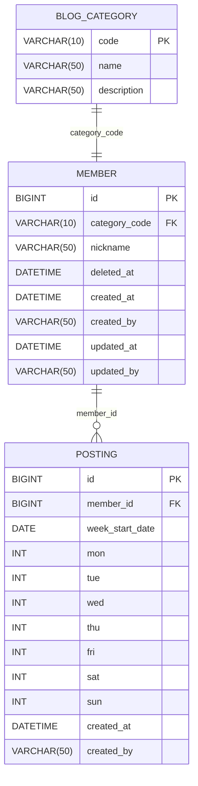

## ERD 다이어그램

```mermaid
erDiagram

    BLOG_CATEGORY {
        VARCHAR(10) code PK
        VARCHAR(50) name
        VARCHAR(50) description
    }

    MEMBER {
        BIGINT id PK
        VARCHAR(10) category_code FK
        VARCHAR(50) nickname
        DATETIME deleted_at
        DATETIME created_at
        VARCHAR(50) created_by
        DATETIME updated_at
        VARCHAR(50) updated_by
    }

    POSTING {
        BIGINT id PK
        BIGINT member_id FK
        DATE week_start_date
        INT mon
        INT tue
        INT wed
        INT thu
        INT fri
        INT sat
        INT sun
        DATETIME created_at
        VARCHAR(50) created_by
    }

    BLOG_CATEGORY ||--|| MEMBER : "category_code"
    MEMBER ||--o{ POSTING : "member_id"
```