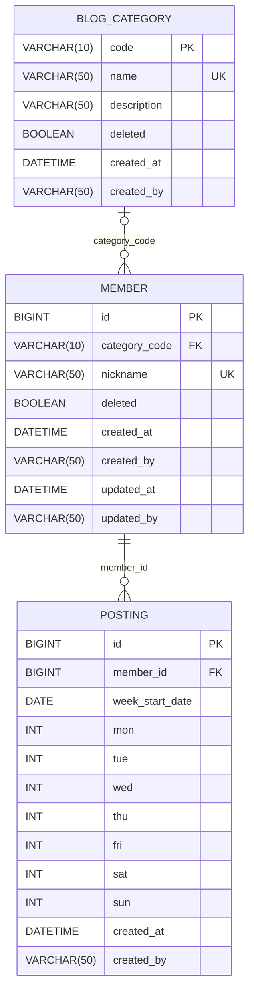
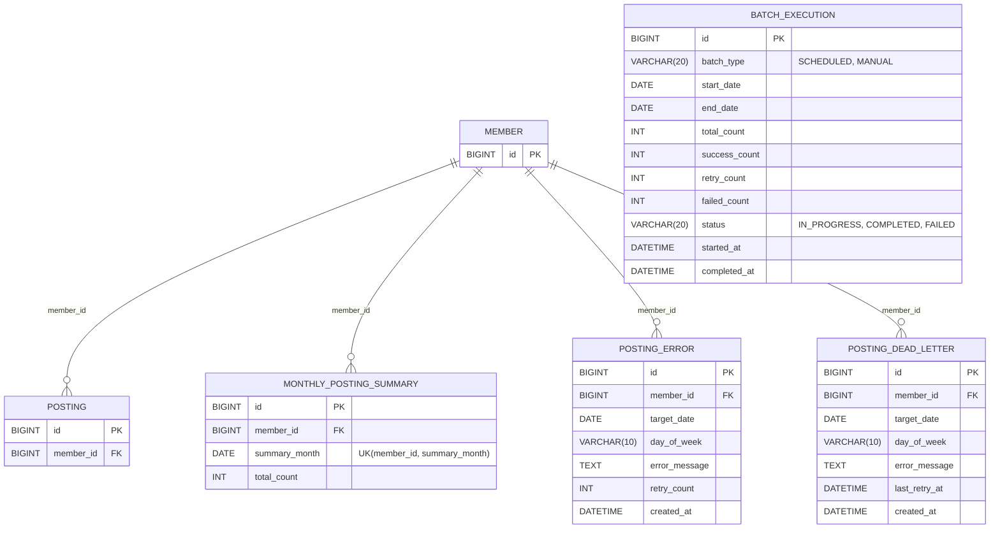

## ERD 다이어그램

### 핵심 도메인

회원/카테고리/포스팅 원본 데이터를 다룬다.

### 배치/모니터링 도메인

`posting` 배치 파이프라인(크롤링 → 저장 → 재시도 → 집계)이 사용하는 운영성 테이블이다. `BATCH_EXECUTION`은 실행 단위(배치 1회 실행)를 기록하며 회원과는 직접 연관관계가 없다.

- `MONTHLY_POSTING_SUMMARY`는 `POSTING` 저장 트랜잭션 커밋 후 `StatisticsUpdateEvent`를 통해 비동기로 upsert된다 (회원 x 월 단위 총 포스팅 수 집계).
- `POSTING_ERROR`는 재시도 3회를 초과하면 `POSTING_DEAD_LETTER`로 이동하고 원본 레코드는 삭제된다.

전체 파이프라인 흐름은 [../README.md](../README.md#43-포스팅-수집-배치-파이프라인)의 아키텍처 다이어그램을 참고한다.